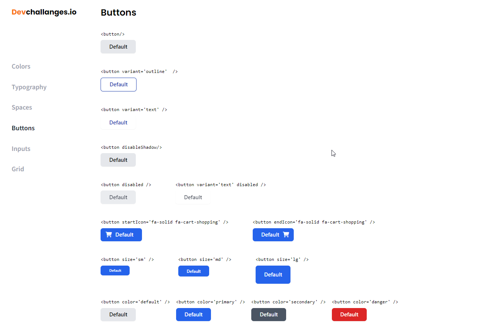

<!-- Please update value in the {}  -->

<h1 align="center">Button Component</h1>

<div align="center">
   Solution for a challenge from  <a href="http://devchallenges.io" target="_blank">Devchallenges.io</a>.
</div>

<div align="center">
  <h3>
    <a href="https://button-component-rouge.vercel.app/" target="_blank">
      Demo
    </a>
    <span> | </span>
    <a href="https://devchallenges.io/solutions/QDixYYhy6Ogzs8p5Fz7X" target="_blank">
      Solution
    </a>
    <span> | </span>
    <a href="https://devchallenges.io/challenges/ohgVTyJCbm5OZyTB2gNY" target="_blank">
      Challenge
    </a>
  </h3>
</div>

<!-- TABLE OF CONTENTS -->

## Table of Contents

- [Overview](#overview)
- [Installation](#installation)
- [Built With](#built-with)
- [Features](#features)
- [Acknowledgements](#acknowledgements)


<!-- OVERVIEW -->

## Overview



#### Installation:

1. Clone the repository:

   ```bash
   git clone https://github.com/render217/button_component
   ```

2. Navigate into the directory and install dependencies:

   ```bash
   npm install
   ```

3. Start the development server:
   ```bash
   npm run dev
   ```

### Built With

<!-- This section should list any major frameworks that you built your project using. Here are a few examples.-->

- **React** 
- **Tailwind**


## Features

<!-- List the features of your application or follow the template. Don't share the figma file here :) -->

This application/site was created as a submission to a [DevChallenges](https://devchallenges.io/challenges) challenge. The [challenge](https://devchallenges.io/challenges/wBunSb7FPrIepJZAg0sY) was to build an application to complete the given user stories.


- User story: I can see different button types: default, outline and text
- User story: I can choose to disable box-shadow
- User story: I can choose to disable the button
- User story: I can choose to have an icon on the left or right (Use Google Icon and at least 5 variants)
- User story: I can have different button sizes
- User story: I can have different colors
- User story: When I hover or focus, I can see visual indicators
- User story: I can still access all button attributes
- User story (optional): Show button in a similar way like the design or use Storybook. Otherwise, showing the button in multiple states is enough

## Acknowledgements
- [Vercel](https://vercel.com/)
- [fontawesome)](https://fontawesome.com/)

